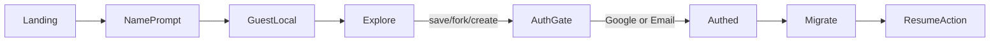

# Next Steps: Guest → Auth Lifecycle

**Role:** Technical product / architecture recalibration  
**Stack:** Django JSON APIs + React SPA (Vite/TS, TanStack Query) + session/CSRF; email auth exists today; Google OAuth and games/high scores are targets.  
**Status:** Sprint 1 + Sprint 2 core shipped (guest shell, migrate drafts/scores/forks, Google ID token, Game/GameScore APIs). Magic link still optional.  
**Date:** 2026-07-30

---

## Sprint 2 status

| Item | Status |
|------|--------|
| `Game` + `GameScore` + score API | Done (`/api/games/`, `/api/games/<slug>/scores/`) |
| Guest `recordScore` → IndexedDB | Done (+ keep-score soft prompt) |
| Migrate v2: scores + `pending_forks` | Done |
| Soft “keep this score” prompts | Done (`KeepScoreGate`) |
| Magic link | Deferred (optional) |
| Rate limits / payload size caps | Partial (migrate body cap, score max, history caps) |

Seeded games: `orbit-run`, `sandbox-score`. Embeds can post scores via:

```js
parent.postMessage({ type: 'sketches101-score', game: 'orbit-run', score: 1200 }, '*')
```

---

## 1. Core User Flow & Architecture Blueprint

### User states

| State | Identity | Persistence | Capabilities |
|-------|----------|-------------|--------------|
| **Anonymous visitor** | None | — | Sees marketing / gallery only (optional short path) |
| **Guest** | `guestId` (UUID) + display `name` | Browser: IndexedDB (+ localStorage mirror for name/id), **30-day TTL** | Play, explore, sandbox edit; **cannot** save / fork / create |
| **Authenticated** | Django `User` (+ profile) | Server DB | Save, fork, create, permanent scores / history |

### Conversion triggers (hard gates)

Any of these while **Guest** → show **AuthGate** (Google OAuth **or** email verification), then continue the interrupted action:

1. Save sketch / save sandbox edits  
2. Fork a public sketch  
3. Create a new sketch  

Optional later: publish, claim a leaderboard row, sync across devices.

### Logical data model

```
GuestProfile (client)
  guestId, displayName, createdAt, expiresAt
  drafts[]          // unsaved code / multi-file
  pendingForks[]    // intent: sourceSlug + local edits
  gameHistory[]     // { gameId, score, playedAt, meta }
  highScores{}      // gameId → best score (+ optional run payload)

UserProfile (server)
  user_id
  display_name
  migrated_from_guest_id?   // idempotency
  sketches / drafts
  GameScore rows
```

### Local → cloud migration (post-login)

1. Auth succeeds → session cookie set (existing SPA CSRF flow).  
2. Client calls `POST /api/auth/migrate-guest/` with guest payload (or chunked uploads).  
3. Server upserts under `request.user`, **idempotent** on `guestId`.  
4. Client clears guest store (or marks `migratedAt`) and invalidates queries.  
5. Resume pending action (save / fork / create) with the authenticated API.



---

## 2. Frontend Tasks

### Sprint-critical UX

1. **GuestNameGate** (first visit)  
   - Single field: Name → create guest profile  
   - Prefer **required** for score attribution; optional “Continue as Guest” only if product allows play without scores

2. **GuestProfileProvider** (React context)  
   - Load/create guest from IndexedDB  
   - Expose: `{ guest, isGuest, isAuthed, requireAuth(action), updateDraft, recordScore }`  
   - Compose with existing `AuthProvider` (auth wins when both exist)

3. **Guest storage module** (`frontend/src/guest/`)  
   - IndexedDB schema + 30-day expiry prune on boot  
   - localStorage: `sketches101-guest-id`, `sketches101-guest-name` (fast boot)  
   - Version field for schema migrations

4. **AuthGate modal**  
   - Copy: “Save your work — sign in to continue”  
   - Actions: **Continue with Google**, **Email**, Cancel  
   - Store `pendingAction` in memory (+ sessionStorage for OAuth return)

5. **Wire gates into existing flows**  
   - Create sketch, Fork (detail), Save (IDE/settings) → `requireAuth()` first  
   - Guests may still open IDE in **sandbox mode** (no persist)

6. **Sandbox IDE mode**  
   - Edit without ownership `slug`; drafts live in guest store  
   - On save after auth: create sketch or patch draft via migrate + API

7. **Post-auth resume**  
   - OAuth / email verify return → read `pendingAction` → migrate → execute

8. **UI states**  
   - Header: guest chip (“Playing as {name}”) vs avatar menu  
   - Soft prompt on high-score moments: “Sign in to keep this score forever”

### Checklist

- [ ] IndexedDB guest store + TTL  
- [ ] Name onboarding modal  
- [ ] `requireAuth(intent)` + AuthGate  
- [ ] Sandbox drafts / scores write paths  
- [ ] Migrate client + clear store  
- [ ] Header guest vs auth chrome  

---

## 3. Backend & Authentication Tasks

### Auth (gap vs today)

| Capability | Today | Target |
|------------|-------|--------|
| Email/password + verification | Yes (API) | Keep; optionally add **magic link** as primary email path |
| Google OAuth | No | Add (`django-allauth` or custom Google Identity + Django user link) |
| Guest migrate API | No | New |

### Google

- [ ] Google Cloud OAuth client  
- [ ] `GET/POST /api/auth/google/` (or allauth redirect + SPA callback)  
- [ ] Link/create `User`, issue session; CSRF cookie unchanged  

### Email

- [ ] Keep signup + verify **or** add magic-link `POST /api/auth/email/start` + `…/confirm`  
- [ ] After verify: same migrate hook as Google  

### Schema (additive)

```text
UserProfile (or extend User)
  display_name
  avatar_url?
  guest_migration_ids  // for idempotency

GuestMigrationLog
  guest_id (uuid, unique with user)
  user_id
  migrated_at
  payload_hash

Game
  slug, title, …

GameScore
  user_id
  game_id
  score, meta JSON, played_at
  unique_best strategy (per user + game)
```

### APIs

| Endpoint | Purpose |
|----------|---------|
| `GET /api/auth/me/` | Extend: `display_name`, `is_guest: false` |
| `POST /api/auth/migrate-guest/` | Body: guest profile blob; returns merged summary |
| `POST /api/auth/google/` | Token/code exchange → session |
| Create / fork / source APIs | **401 + `code: auth_required`** if anonymous |
| `POST /api/games/<slug>/scores/` | Authed; guest scores only via migrate |

### Server rules

- Never trust client high scores without validation (caps, basic anti-abuse).  
- Enforce auth on save / fork / create.  
- Idempotent migrate: same `guestId` twice → no duplicate scores/drafts.

---

## 4. Feature & Data Migration Logic

### Payload (client → server)

```json
{
  "guest_id": "uuid",
  "display_name": "Ada",
  "created_at": "...",
  "drafts": [
    {
      "client_id": "...",
      "title": "...",
      "sketch_type": "p5js",
      "files": []
    }
  ],
  "pending_forks": [
    { "source_slug": "...", "files": [] }
  ],
  "scores": [
    {
      "game": "orbit-run",
      "score": 1200,
      "played_at": "...",
      "meta": {}
    }
  ]
}
```

### Merge algorithm

1. **Reject / short-circuit** if `guest_id` already in `GuestMigrationLog` for this user (return previous result).  
2. Set `UserProfile.display_name` if empty (prefer guest name).  
3. **Drafts** → create `Sketch` drafts owned by user (or update if `client_id` mapped). Cap N drafts (e.g. 20).  
4. **Pending forks** → run fork service with guest files as starting source.  
5. **Scores** → insert runs; update best if higher; skip invalid.  
6. Write `GuestMigrationLog`.  
7. Response: `{ sketches_created, scores_imported, resumed: null }`.

### Conflict policy

| Conflict | Policy |
|----------|--------|
| User already has better score | Keep max; optionally store run history |
| Duplicate draft `client_id` | Upsert / skip |
| Expired guest (>30d) | Allow one-time migrate if client still has data; don’t recreate guest |

### Resume after migrate

| Pending action | After migrate |
|----------------|---------------|
| `save` | PATCH/POST source for created draft or current slug |
| `fork` | Open forked slug in IDE |
| `create` | Navigate to new draft settings / IDE |

---

## 5. Prioritized Action Plan

### Sprint 1 — Guest shell + auth gates (no games yet)

**Goal:** Recalibrate onboarding and conversion on **existing** sketch flows.

| Order | Work | Depends on |
|------:|------|------------|
| 1 | Guest store (IndexedDB + TTL) + Name gate | — |
| 2 | `GuestProfileProvider` + header “Playing as…” | 1 |
| 3 | AuthGate + `pendingAction` | 2 |
| 4 | Gate Create / Fork / Save in SPA; sandbox IDE without save | 3 |
| 5 | Server: harden 401 on manage APIs; migrate endpoint **v1** (drafts only) | 4 |
| 6 | Email path: existing signup/login → call migrate | 5 |
| 7 | Google OAuth spike → production callback | 5–6 |

**Exit criteria:** Guest can set a name, edit sandbox, and must auth to save/fork/create; after email login, drafts land in account.

### Sprint 2 — Scores, Google polish, resume reliability

| Order | Work | Depends on |
|------:|------|------------|
| 1 | `Game` + `GameScore` schema + score API | Sprint 1 |
| 2 | Client score recording into guest store | 1 |
| 3 | Migrate v2: scores + pending forks + idempotency log | 1–2 |
| 4 | Google Auth complete + resume after OAuth redirect | Sprint 1 #7 |
| 5 | Magic link (optional) or keep password + verify | Product choice |
| 6 | Anti-abuse: rate limits, score caps, migrate size limits | 3 |
| 7 | Analytics: gate impressions, convert rate, migrate success | Ongoing |

**Exit criteria:** Play-as-guest → score locally → sign in with Google/email → scores + drafts permanent; interrupted save/fork resumes.

---

## 6. Immediate tickets (start here)

1. Spec `GuestProfile` IndexedDB schema + expiry helper (FE).  
2. Ship NameGate + provider (feature-flag if needed).  
3. AuthGate + wrap Create / Fork / Save.  
4. `POST /api/auth/migrate-guest/` drafts-only + tests.  
5. Google OAuth design doc (allauth vs custom) + env vars for deploy host.

---

## 7. Risks

- **OAuth return** must preserve `pendingAction` (sessionStorage).  
- **Large drafts** need size limits / chunking.  
- Current SPA assumes auth for IDE manage APIs — sandbox mode must not hit those until migrate.  
- Games aren’t built yet: don’t block Sprint 1 on leaderboards; keep score schema for Sprint 2.

---

## Related docs

- `PRD.md` — older nav-focused PRD (Django templates era); do not treat as source of truth for guest auth.  
- `frontend/README.md` — SPA run / deploy notes.  
- `design-system/sketches101/MASTER.md` — brand / UI constraints.
