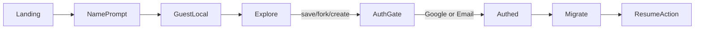

# Next Steps: Guest → Auth + Retention

**Role:** Technical product / architecture  
**Stack:** Django JSON APIs + React SPA (Vite/TS, TanStack Query) + session/CSRF; email auth + Google ID token; Game/GameScore APIs.  
**Status:** Sprint 1–4 **done**. Sprint 5 started (weekly challenge strip shipped).  
**Date:** 2026-07-31

---

## Sprint 1–2 status (shipped)


| Item                                                              | Status               |
| ----------------------------------------------------------------- | -------------------- |
| Guest IndexedDB store + TTL + NameGate                            | Done                 |
| GuestProfileProvider + header “Playing as…”                       | Done                 |
| AuthGate + `pendingAction` + Create/Fork/Save gates               | Done                 |
| Sandbox IDE (guest local drafts)                                  | Done                 |
| `POST /api/auth/migrate-guest/` (drafts + scores + pending_forks) | Done                 |
| Email login → migrate + resume                                    | Done                 |
| Google ID token → session                                         | Done                 |
| `Game` + `GameScore` + score API                                  | Done                 |
| Guest `recordScore` → IndexedDB + KeepScoreGate                   | Done                 |
| Soft “keep this score” prompts                                    | Done                 |
| Magic link                                                        | Deferred (Sprint 4+) |
| Payload size / score caps                                         | Done (Sprint 2)      |
| Request rate limits                                               | Done (Sprint 3)      |


Seeded games: `orbit-run`, `sandbox-score`. Embeds can post scores via:

```js
parent.postMessage({ type: 'sketches101-score', game: 'orbit-run', score: 1200 }, '*')
```

---

## 1. Core User Flow (reference)


| State             | Identity                 | Persistence                                   | Capabilities                                                        |
| ----------------- | ------------------------ | --------------------------------------------- | ------------------------------------------------------------------- |
| **Guest**         | `guestId` + display name | IndexedDB (+ localStorage mirror), 30-day TTL | Play, explore, sandbox; **cannot** save / fork / create permanently |
| **Authenticated** | Django `User`            | Server DB                                     | Save, fork, create, permanent scores                                |


Hard gates (Guest → AuthGate → migrate → resume): Save, Fork, Create.




---

## Sprint 3 — Guest polish + retention (done)


| Order | Work                                                                            | Status |
| ----- | ------------------------------------------------------------------------------- | ------ |
| A1    | Authed sandbox **Save to account** (`createSketch` + `saveSketchSource` → edit) | Done   |
| A2    | Remove unused `queuePendingFork` export; migrate failure UI + Retry sync        | Done   |
| B     | Cache rate limits: migrate 10/h/user, scores 60/min/user, Google 30/min/IP      | Done   |
| C     | Authed home Continue editing + recently viewed; header Continue chip            | Done   |
| D     | `sort=random` + `exclude` API; Gallery **Surprise me** play mode (→ / F / Esc)  | Done   |
| E     | This doc refresh                                                                | Done   |


**Exit criteria:** Authed sandbox save lands in account IDE; rate limits return `429` + `code: rate_limited`; logged-in home/header resume unfinished work; gallery play mode browses embeds continuously.

### Key paths

- Sandbox save: `[frontend/src/pages/SandboxPage.tsx](frontend/src/pages/SandboxPage.tsx)`
- Rate limit helper: `[sketches/api/http.py](sketches/api/http.py)` `enforce_rate_limit`
- Continue: `[frontend/src/hooks/useContinueSketch.ts](frontend/src/hooks/useContinueSketch.ts)`, `[frontend/src/lib/recentViews.ts](frontend/src/lib/recentViews.ts)`
- Play mode: `[frontend/src/components/gallery/GalleryPlayMode.tsx](frontend/src/components/gallery/GalleryPlayMode.tsx)`

---

## Sprint 4 backlog

1. **Maker profile** — `/makers/<username>/` — **Done**
2. **Sketch of the day** — `/explore/today` — **Done** (`GET /api/explore/today/`, date-seeded pick)
3. **Bookmark / Saved** — `/saved` localStorage — **Done** (server sync later)
4. **Weekly challenge strip** on Home/Explore — **Done** (`WeeklyChallenge`, `GET /api/challenges/current/`)
5. **Related / fork tree** on sketch detail — **Done** (`related` + `forks` on detail API)
6. **Magic link** email path (optional) — deferred
7. **Analytics** — AuthGate impressions, convert rate, migrate success — deferred
8. **Chunked migrate** for very large drafts — deferred
9. **Server-synced bookmarks** — deferred

Avoid first: Pro tier, notifications inbox, comments.

---

## Frontend checklist (historical — Sprint 1–2)

- [x] IndexedDB guest store + TTL  
- [x] Name onboarding modal  
- [x] `requireAuth(intent)` + AuthGate  
- [x] Sandbox drafts / scores write paths  
- [x] Migrate client + clear store  
- [x] Header guest vs auth chrome  
- [x] Authed sandbox save to account (Sprint 3)  
- [x] Continue chip + recently viewed (Sprint 3)  
- [x] Gallery play mode (Sprint 3)  

---

## Backend checklist (historical)

- [x] Google ID token verify → session  
- [x] `POST /api/auth/migrate-guest/` idempotent  
- [x] `Game` / `GameScore` + score API  
- [x] Auth on manage APIs (`401` + `auth_required`)  
- [x] Request rate limits on migrate / scores / Google (Sprint 3)  
- [x] `sort=random` + `exclude` on sketch list (Sprint 3)  
- [ ] Magic link (deferred)  

---

## Risks (still relevant)

- **OAuth return** must preserve `pendingAction` (sessionStorage).  
- **Large drafts** — single-payload migrate; chunking is Sprint 4.  
- Play mode uses `order_by('?')` — fine at current scale; revisit if gallery grows huge.

---

## Related docs

- `[PRD.md](PRD.md)` — older nav-focused PRD; not source of truth for guest auth.  
- `[frontend/README.md](frontend/README.md)` — SPA run / deploy.  
- `[design-system/sketches101/MASTER.md](design-system/sketches101/MASTER.md)` — brand / UI.  
- `[temp.md](temp.md)` — retention brainstorm (Sprint 4+ ideas).

